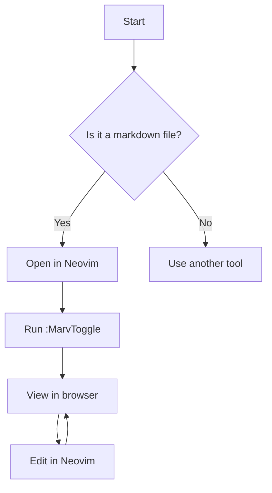
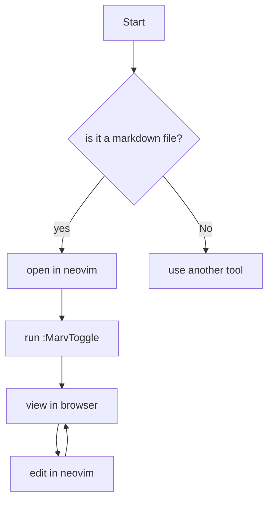

# marv

(mar)kdown (v)im: Live markdown previews in the browser.

## supported platforms

- Linux x86_64 (amd64) 
- macOS ARM64 (Apple Silicon) - when built on macOS

You can build for your native platform by running `make build` on either Linux or macOS.

## installation

use git or your plugin manager of choice to install marv.

## mermaid support

marv supports rendering [mermaid](https://mermaid.js.org/intro) diagrams in your markdown files. Simply use the standard markdown code block syntax with the `mermaid` language identifier:

````

````

when previewed with marv, the diagram above will render like this:



### commands

* `MarvToggle`: toggles live preview in your default browser.

#### mapping example

```lua
-- In your init.lua or other Lua config file
vim.keymap.set('n', '<Leader>m', ':MarvToggle<CR>', { noremap = true, silent = true }
```

## development

this project uses a Makefile to automate common development tasks.

to see all available tasks:

```bash
make help
```

### makefile tab completion (optional)

add the following function to your bash config:

```bash
_make_completion() {
    local cur prev targets

    COMPREPLY=()
    cur="${COMP_WORDS[COMP_CWORD]}"
    prev="${COMP_WORDS[COMP_CWORD-1]}"

    # Parse Makefile targets
    targets=$(make -qp | awk -F':' '/^[a-zA-Z0-9][^$#\/\t=]*:([^=]|$)/ {split($1,A,/ /);print A[1]}' | sort -u)

    COMPREPLY=( $(compgen -W "${targets}" -- ${cur}) )
    return 0
}
complete -F _make_completion make
```
